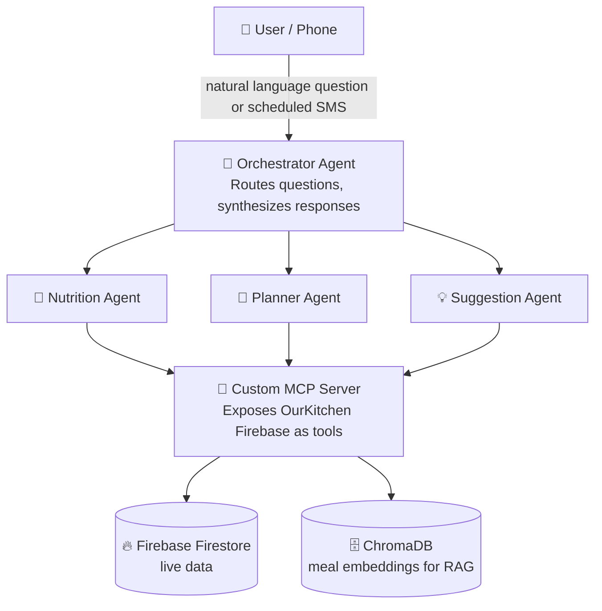

# 🧠 thebrain
> A personal AI intelligence layer built with multi-agent orchestration, RAG, and MCP servers on top of household app data

TheBrain connects to the suite of household apps I built for my family — meal planning, fitness tracking -
and answers questions across all of it using multi-agent orchestration, RAG, 
custom MCP servers, and proactive scheduled summaries.

I built TheBrain as a portfolio project to demonstrate agentic AI system design, and to begin exploring AI Product roles. 
I currently work in Advisory at KPMG (Capital Markets / Financial Services Operations). 
I have no formal software engineering background — I taught myself and shipped 
the household apps first, then built an Agentic layer on top of them.

---

## 🎯 What It Does

**Natural Language Q&A**
> "What have we been cooking most this month? Are we hitting our protein goals?"

**Proactive weekly summaries pushed to our phones**
> Every Sunday, OurBrain sends a digest of nutrition patterns, meal variety, 
> and personalized suggestions for the week ahead.

**Pattern-based Coaching**
> "You haven't cooked a high-protein meal in 5 days — here's a suggestion 
> based on your preferences and what's already in your weekly planner."

---

## 🏗️ Architecture



---

## 🧩 AI Concepts Demonstrated

| Concept | Where It Appears |
|---|---|
| **MCP Server** | Custom Python server exposing Firestore as Claude tools |
| **Multi-Agent Orchestration** | Orchestrator routes to Nutrition, Planner, and Suggestion agents |
| **RAG** | Meal history and preferences embedded in ChromaDB for semantic retrieval |
| **Tool Use** | Agents call Firestore tools to fetch live data before reasoning |
| **Evals** | Test suite scoring accuracy and usefulness of OurBrain responses |
| **Scheduled Agents** | Cron-triggered weekly summary delivered via SMS |

---

## 📦 Tech Stack

- **Language:** Python
- **LLM:** Anthropic Claude API (`claude-sonnet-4-6`)
- **Embeddings:** Voyage AI (`voyage-2`)
- **Data Source:** Firebase Firestore (OurKitchen app - live household data)
- **Vector Store:** ChromaDB
- **Delivery:** Twilio SMS
- **Dev Environment:** Jupyter Notebooks
- **Version Control:** GitHub

---

## 🗂️ Project Structure

```
TheBrain/
├── notebooks/
│   ├── 01_firebase_connection.ipynb   ✅ Phase 1
│   ├── 02_mcp_server.ipynb            ✅ Phase 2
│   ├── 3a_rag_embed.ipynb             ✅ Phase 3
│   ├── 3b_rag_retrieval.ipynb         ✅ Phase 3
│   ├── 04_agents.ipynb                🔜 Phase 4
│   ├── 05_evals.ipynb                 🔜 Phase 5
│   └── 06_scheduled_summary.ipynb     🔜 Phase 6
├── mcp_server/
│   └── ourbrain_server.py
├── agents/                            # Phase 4 - multi-agent layer
│   ├── __init__.py            
│   ├── mcp_host.py                    # custom MCP host
│   ├── agent_runner.py                # the agent loop
│   ├── sub_agents.py.                 # Nutrition / Planner / Suggestion'
├── credentials/                       # gitignored
├── secrets.json                       # gitignored
├── .env.example
├── README.md
└── requirements.txt
```

---

## 🗺️ Build Roadmap

- ✅ **Phase 1 — Data Foundation**
  - ✅ Connected to live Firestore data from Python across meals, weekly planner history, and household preferences.
  - ✅ Set up credential and secrets management used across all notebooks.
  - ✅ Build basic Q&A over raw data

- ✅ **Phase 2 — MCP Server**
  - ✅ Define tools: `get_meals`, `get_weekly_history`, `get_preferences`
  - ✅ Built a custom Python MCP server that exposes OurKitchen's Firestore data as tools Claude can call on demand
  - ✅ Verify Claude can call tools and reason over results

- ✅ **Phase 3 — RAG Pipeline:** RAG was implemented alongside tools from Phase 2 to answer qualitative questions from my family - i.e., what meal can we make that is light and fresh
  - ✅ Embedded meal history into ChromaDB using Voyage AI and built a semantic retrieval layer that feeds into Claude's context.
  - ✅ Test semantic retrieval ("what are some meals that are comfort food on a cold night")
  - ✅ Wire RAG results into agent context

**Key Takeaway** - Retrieval is only as good as the data chunks — meals with descriptive notes return better results than meals with structured fields only. Something to improve as the dataset grows
    
- [ ] **Phase 4 — Multi-Agent Orchestration**
  - [ ] Build Nutrition Agent
  - [ ] Build Planner Agent
  - [ ] Build Suggestion Agent
  - [ ] Build Orchestrator that routes and synthesizes

**Key Takeaway** - The Suggestion Agent initially reframed dietary restrictions ("no pork") as "underutilized proteins" and recommended pork dishes despite acknowledging the restriction. Fixed via explicit hard-rule guardrails in the system prompt that listed variants of restricted ingredients and forbid rationalizing exceptions. A production-grade fix would add post-response validation as a second layer (planned for the Evals phase).

- [ ] **Phase 5 — Evals**
  - [ ] Define 20 test questions with expected answers
  - [ ] Build scoring logic
  - [ ] Run evals after any major change

- [ ] **Phase 6 — Scheduled Delivery**
  - [ ] Build weekly summary prompt
  - [ ] Set up cron job
  - [ ] Wire to SMS delivery

---

## 🔗 Related Projects

This project is part of a personal household app ecosystem:
- **[OurKitchen]** — Shared household meal planner and grocery list (Firebase + Claude API)
- **[OurFitness]** — Shared household workout tracker (coming soon as a data source)

---

## 👤 About

Built by Sagar — exploring agentic AI system design as a pathway into AI Product roles. 
- Background in Electrical Engineering and currently in advisory at KPMG
- Self-taught builder
- Shipped multiple household apps before this project.
